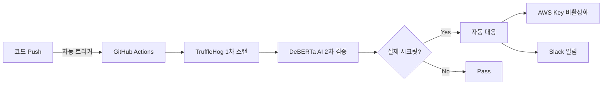

#  Secret-Watchdog

<div align="center">

**TruffleHog + DeBERTa AI 기반 지능형 시크릿 자동 탐지 및 대응 시스템**

[](https://github.com/features/actions)
[](https://www.python.org/)
[](https://huggingface.co/microsoft/deberta-v3-base)
[](https://github.com/trufflesecurity/trufflehog)

</div>

---

##  프로젝트 소개

본 시스템은 GitHub 저장소에 실수로 push되는 시크릿(API 키, 비밀번호, 토큰 등)을 **2단계 하이브리드 방식**으로 탐지하고 자동으로 대응하는 CI/CD 파이프라인입니다.

###  동작 흐름



개발자는 **평소처럼 코드를 작성하고 push**하면, 시스템이 백그라운드에서 자동으로 시크릿을 감시하고 대응합니다.

###  핵심 기능

| 기능 | 설명 | 효과 |
|------|------|------|
| **2단계 탐지** | TruffleHog + DeBERTa AI | 오탐률 98% → 1.17% 감소 |
| **자동 대응** | AWS Access Key 즉시 비활성화 | 보안 사고 예방 |
| **실시간 알림** | Slack Webhook 통보 | 즉각적인 대응 가능 |
| **CI/CD 통합** | GitHub Actions 자동 실행 | 추가 작업 불필요 |

---

##  폴더 구조

본 시스템을 설치하면 다음과 같은 구조가 생성됩니다.

```
your-existing-repo/                    # 사용자의 기존 저장소
├── .github/
│   └── workflows/
│       └── security_pipeline.yml      #  GitHub Actions 워크플로우 (루트로 복사됨)
│
├── [기존 프로젝트 파일들...]
│
└── security-system/                   #  보안 시스템 폴더 (통째로 추가)
    ├── src/
    │   ├── parser.py                  # TruffleHog 결과 → AI 입력 포맷으로 변환
    │   ├── ai_filter.py               # DeBERTa 기반 2차 시크릿 판별
    │   ├── remediate_keys.py          # AWS Access Key 자동 비활성화 + 일반 시크릿 기록
    │   └── notify_slack.py            # Slack Webhook으로 요약 알림 전송
    │
    ├── remediate-test/                # 테스트용 샘플 폴더
    │   └── test_secret_sample.py
    │
    ├── models/                        # AI 모델 저장 폴더
    │   └── model.pt                   # Google Drive에서 자동 다운로드 (실행 시 생성)
    │
    ├── outputs/                       # GitHub Actions 실행 중 생성되는 결과물
    │   ├── 01-trufflehog-scan-results.json
    │   ├── 02-parsed-results.json
    │   ├── 03-ai-predictions.json
    │   ├── 04-analysis-report.txt
    │   ├── 05-remediation-results.json
    │   ├── 06-slack_notification_log.txt
    │   ├── complete-pipeline-outputs.zip
    │   
    │
    └── requirements.txt               # Python 의존성 목록
```

> **참고**: `outputs/` 폴더의 파일들은 GitHub Actions 실행 중에만 생성됩니다.

---

##  환경 구성

### 1️ 기존 저장소에 시스템 설치

본 시스템을 **기존 프로젝트에 추가** 하려면 다음 명령어를 실행하세요.

```bash
# 1. Secret_Watchdog 레포지토리에서 install.sh 다운로드

# 2. 기존 프로젝트 저장소로 이동
cd /path/to/your/existing/project

# 3. install.sh 실행권한 부여
chmod u+x ./install.sh

# 4. install.sh 실행
./install.sh
```

> **설치 완료!** 이제 코드를 push할 때마다 자동으로 시크릿 탐지가 실행됩니다.

### 2️ GitHub Secrets 설정

저장소의 보안 설정을 위해 다음 값들을 GitHub Secrets에 등록해야 합니다.

**경로**: `Settings` → `Secrets and variables` → `Actions` → `New repository secret`

| Secret 이름 | 설명 | 필수 여부 |
|-------------|------|----------|
| `SLACK_WEBHOOK_URL` | Slack 알림을 받을 Webhook URL |  필수 |
| `AWS_ACCESS_KEY_ID` | AWS IAM 사용자 Access Key ID |  AWS 자동 대응 사용 시 |
| `AWS_SECRET_ACCESS_KEY` | AWS IAM 사용자 Secret Access Key |  AWS 자동 대응 사용 시 |

####  Slack Webhook URL 생성 방법

1. Slack 워크스페이스에서 `Apps` → `Incoming Webhooks` 검색 및 추가
2. 알림을 받을 채널 선택
3. 생성된 Webhook URL 복사
   - 형식: `https://hooks.slack.com/services/XXX/YYY/ZZZ`

####  AI 모델 설정

본 시스템은 기본적으로 학습된 DeBERTa 모델을 자동으로 다운로드합니다.

**기본 모델 (이미 설정됨):**
- 모델 ID는 `.github/workflows/security_pipeline.yml` 파일에 하드코딩되어 있습니다
- 별도 설정 없이 바로 사용 가능합니다

**커스텀 모델 사용 (선택사항):**

자체 학습한 모델을 사용하려면:

1. Google Drive에 모델 파일(`.pt`) 업로드
2. 파일 공유 설정 → "링크가 있는 모든 사용자" 권한 부여
3. 파일 ID 추출 (URL에서 `/d/FILE_ID/view` 부분)
4. `.github/workflows/security_pipeline.yml` 파일 수정:

```yaml
- name: Download AI Model from Google Drive
  env:
    MODEL_GDRIVE_ID: "YOUR_CUSTOM_MODEL_ID"  # 이 부분을 변경
  run: |
    echo "Downloading AI model..."
    mkdir -p models
    gdown $MODEL_GDRIVE_ID -O models/model.pt
```

또는 GitHub Secrets로 관리하려면:

1. GitHub Secrets에 `MODEL_GDRIVE_ID` 추가
2. 워크플로우 파일에서:

```yaml
- name: Download AI Model from Google Drive
  env:
    MODEL_GDRIVE_ID: ${{ secrets.MODEL_GDRIVE_ID }}  # Secrets 사용
```

####  AWS 자격 증명 설정 (선택사항)

AWS Access Key 자동 비활성화 기능을 사용하려면:

1. **AWS IAM Console**에서 사용자 생성 또는 선택
2. **필요 권한 정책 연결**:
   ```json
   {
     "Version": "2012-10-17",
     "Statement": [
       {
         "Effect": "Allow",
         "Action": [
           "iam:UpdateAccessKey",
           "iam:ListAccessKeys"
         ],
         "Resource": "*"
       }
     ]
   }
   ```
3. **Access Key 생성** 후 GitHub Secrets에 등록:
   - `AWS_ACCESS_KEY_ID`: Access Key ID
   - `AWS_SECRET_ACCESS_KEY`: Secret Access Key

> **보안 팁**: IAM 사용자는 최소 권한 원칙에 따라 필요한 권한만 부여하세요.

---

##  사용 방법

###  기본 사용 (권장)

설치가 완료되면 **별도의 추가 작업 없이** 자동으로 동작합니다.

```bash
# 평소처럼 개발하세요
git add .
git commit -m "Implement user authentication"
git push origin main
```

**그러면 자동으로:**

1.  GitHub Actions가 트리거됩니다
2.  TruffleHog가 변경된 파일을 스캔합니다
3.  DeBERTa AI가 오탐을 필터링합니다
4.  실제 시크릿 발견 시:
   - AWS Access Key는 즉시 비활성화
   - Slack 채널로 알림 전송
   - GitHub Actions 로그에 상세 기록

###  결과 확인 방법

#### 1. GitHub Actions 로그

`Actions` 탭에서 최근 워크플로우 실행을 클릭하여 각 단계별 로그를 확인할 수 있습니다:

| 단계 | 설명 |
|------|------|
| **TruffleHog Scan** | 1차 스캔 결과 (모든 의심스러운 패턴 탐지) |
| **AI Filter** | 2차 검증 결과 (오탐 필터링) |
| **Auto Remediation** | AWS 키 비활성화 및 일반 시크릿 기록 |
| **Slack Notification** | 알림 전송 결과 |

#### 2. Slack 알림

시크릿이 탐지되면 다음과 같은 형식으로 Slack 메시지를 받습니다:

```
┏━━━━━━━━━━━━━━━━━━━━━━━━━━━━━━━━━━━━┓
┃   Secret Detection Alert         ┃
┗━━━━━━━━━━━━━━━━━━━━━━━━━━━━━━━━━━━━┛

 Repository: your-org/your-repo
 Branch: main
 Author: user@example.com

━━━━━━━━━━━━━━━━━━━━━━━━━━━━━━━━━━━━

 Detected Secrets (2)

1️. AWS Access Key
    File: src/config.py
    Line: 42
    Confidence: 87%
    Action: Key deactivated

2️. GitHub Token
    File: .env
    Line: 15
    Confidence: 92%
    Action: Team notified

━━━━━━━━━━━━━━━━━━━━━━━━━━━━━━━━━━━━

 View Details: [GitHub Actions Link]
 Detected at: 2025-11-18 14:30:25 KST
```

#### 3. Artifacts 다운로드

GitHub Actions 실행 완료 후 `Artifacts` 섹션에서 다음 파일들을 다운로드할 수 있습니다:

- `analysis_report.txt`: AI 분석 상세 리포트
- `confirmed_secrets.json`: 확인된 시크릿 목록
- `remediation_results.json`: 자동 대응 실행 결과
- `slack_notification_log.txt`: Slack 전송 로그

---

##  고급 설정

###  스캔 대상 경로 변경

`.github/workflows/security_pipeline.yml` 파일에서 스캔할 디렉토리를 변경할 수 있습니다.

**기본 설정 (예제 코드만 스캔):**
```yaml
- name: Run TruffleHog Scan (1st Detection)
  run: |
    SCAN_PATH="./remediate-test/"  # 기본: 테스트 폴더만 스캔
    trufflehog filesystem $SCAN_PATH --json > outputs/trufflehog_results.json
```

**프로젝트 전체 스캔 (권장):**
```yaml
- name: Run TruffleHog Scan (1st Detection)
  run: |
    SCAN_PATH="./"  # 프로젝트 전체 스캔
    trufflehog filesystem $SCAN_PATH --json > outputs/trufflehog_results.json
```

**특정 디렉토리만 스캔:**
```yaml
- name: Run TruffleHog Scan (1st Detection)
  run: |
    SCAN_PATH="./src ./config"  # 여러 경로 지정 가능
    trufflehog filesystem $SCAN_PATH --json > outputs/trufflehog_results.json
```

###  워크플로우 트리거 변경

워크플로우가 실행되는 조건을 변경할 수 있습니다.

**기본 설정 (main 브랜치 push 시):**
```yaml
on:
  push:
    branches: [main]
```

**여러 브랜치에서 실행:**
```yaml
on:
  push:
    branches: [main, develop, staging]
```

**Pull Request 시에도 실행:**
```yaml
on:
  push:
    branches: [main]
  pull_request:
    branches: [main]
```

**수동 실행 추가:**
```yaml
on:
  push:
    branches: [main]
  workflow_dispatch:  # Actions 탭에서 수동 실행 가능
```

###  특정 파일/디렉토리 제외

특정 경로를 스캔에서 제외하려면:

```yaml
on:
  push:
    branches: [main]
    paths-ignore:
      - 'docs/**'           # 문서 폴더 제외
      - 'tests/**'          # 테스트 폴더 제외
      - '*.md'              # 마크다운 파일 제외
      - 'public/**'         # 공개 자산 폴더 제외
      - 'node_modules/**'   # 의존성 폴더 제외
```

###  AI 필터 임계값 조정

`src/ai_filter.py` 파일에서 탐지 민감도를 조정할 수 있습니다.

```python
# 기본값: 0.5 (균형)
THRESHOLD = 0.5

# 보수적 설정: 0.7 (오탐 최소화, 일부 시크릿 놓칠 수 있음)
THRESHOLD = 0.7

# 민감한 설정: 0.3 (모든 의심스러운 항목 탐지, 오탐 증가)
THRESHOLD = 0.3
```

또는 워크플로우 파일에서 직접 설정:

```yaml
- name: Run AI Model Prediction (2nd Detection)
  run: |
    python src/ai_filter.py \
      -i parsed.json \
      -m models/model.pt \
      -o outputs/ai_predictions.json \
      --confidence-threshold 0.70  # 임계값 변경
```

| 임계값 | 탐지 방식 | 권장 상황 |
|--------|-----------|----------|
| 0.3 - 0.4 | 매우 민감 | 보안이 최우선인 프로덕션 환경 |
| 0.5 (기본) | 균형 | 일반적인 개발 환경 |
| 0.6 - 0.7 | 보수적 | 오탐이 많아 피로도가 높은 경우 |

---

##  성능 지표

본 시스템은 다음과 같은 성능을 제공합니다.

<div align="center">

### 전체 성능

| 지표 | TruffleHog Only | 본 시스템 (Hybrid AI) | 개선율 |
|------|----------------|---------------------|--------|
| **Precision** | 2.0% | **92.82%** | ⬆ +90.82%p |
| **Recall** | 100.0% | **85.03%** | Trade-off |
| **F1-Score** | 3.92% | **88.76%** | ⬆ +84.84%p |
| **False Positive Rate** | 98.0% | **1.17%** | ⬇ -96.83%p |
| **Accuracy** | 50.90% | **96.76%** | ⬆ +45.86%p |

</div>

### 카테고리별 Recall 성능

시크릿 유형별로 다음과 같은 탐지율을 보입니다:

<div align="center">

| 카테고리 | Recall | 설명 |
|----------|--------|------|
| **Database URL** | 84.6% (11/13) | 🟢 가장 높은 탐지율 |
| **Auth Token** | 80.6% (83/103) | 🟢 우수한 탐지율 |
| **Private Key** | 66.7% (330/495) | 🔵 가장 중요한 카테고리 (샘플 수 최대) |
| **API Key** | 62.4% (73/117) | 🟡 개선 필요 |
| **Other Categories** | 59.2% (40/91) | 🟡 다양한 기타 시크릿 유형 |

</div>

> ** 성능 특징**:
> - **High Precision (92.82%)**: 시스템이 시크릿이라고 판단한 것은 대부분 실제 시크릿입니다
> - **Balanced Recall (85.03%)**: 실제 시크릿의 약 85%를 성공적으로 탐지합니다
> - **Ultra-Low FP (1.17%)**: 98%였던 오탐률을 1.17%로 획기적으로 감소시켰습니다

### 테스트 환경

- **테스트 데이터**: 2,928 samples (실제 시크릿 441개 포함)
- **모델**: DeBERTa-v3-base
- **최적 임계값**: 0.70
- **Private Key 비중**: 495/802 (61.7%) - SecretBench 데이터셋 기준

---

##  주의 사항

###  보안

- **프라이빗 저장소 사용 권장**: 탐지 결과에 민감한 정보가 포함될 수 있습니다
- **GitHub Secrets 관리**: AWS 자격 증명 등 중요한 정보는 반드시 Secrets에 저장하세요
- **권한 최소화**: AWS IAM 사용자는 필요한 최소 권한만 부여하세요

###  False Positive 대응

- AI 모델도 완벽하지 않으므로, 알림을 받으면 **실제 시크릿인지 확인**이 필요합니다
- 오탐률 1.44%는 매우 낮지만, 대규모 코드베이스에서는 여전히 일부 오탐이 발생할 수 있습니다
- 오탐이 지속되는 경우 [고급 설정](#️-고급-설정)에서 임계값을 조정하세요

###  자동 대응 주의

- **AWS Access Key 자동 비활성화**는 신중하게 사용하세요
- 프로덕션 환경에서 사용 중인 키가 비활성화될 수 있습니다
- 테스트 환경에서 충분히 검증 후 프로덕션에 적용하세요

###  실행 시간

- 저장소 크기에 따라 실행 시간이 달라질 수 있습니다 (일반적으로 2-5분)
- 대용량 저장소의 경우 GitHub Actions 실행 시간 제한(6시간)을 고려하세요

###  Recall Trade-off

- 본 시스템은 **높은 정밀도(92.82%)**와 **낮은 오탐률(1.17%)**에 최적화되어 있습니다
- Recall이 85.03%인 것은 약 15%의 실제 시크릿을 놓칠 수 있다는 의미입니다
- 완벽한 탐지(Recall 100%)가 필요한 경우, 임계값을 낮추거나 TruffleHog 결과도 함께 검토하세요

---

##  기술 스택

<div align="center">

### Core Technologies

[](https://www.python.org/)
[](https://pytorch.org/)
[](https://huggingface.co/transformers/)

### Security & DevOps

[](https://github.com/trufflesecurity/trufflehog)
[](https://github.com/features/actions)
[](https://aws.amazon.com/iam/)

### Communication

[](https://slack.com/)

</div>

---;

###  문의

- 문제가 발생하거나 개선 제안이 있으시면 이메일로 연락주세요.
- GitHub Issues: [프로젝트 이슈 페이지](https://github.com/capstone-stonestone2/Secret_Watchdog/issues)

###  참고 자료

- [TruffleHog 공식 문서](https://github.com/trufflesecurity/trufflehog)
- [DeBERTa 논문](https://arxiv.org/abs/2006.03654)
- [GitHub Actions 가이드](https://docs.github.com/en/actions)
- [AWS IAM 권한 관리](https://docs.aws.amazon.com/IAM/latest/UserGuide/)

---

##  라이센스

본 프로젝트는 교육 및 연구 목적으로 개발되었습니다.

---

<div align="center">

**Developed with  by Capstone Team**

[⬆ Back to Top](#️-hybrid-ai-based-intelligent-secret-detection-and-response-system)

</div>